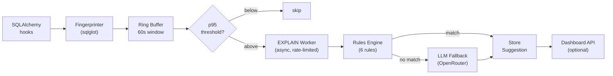
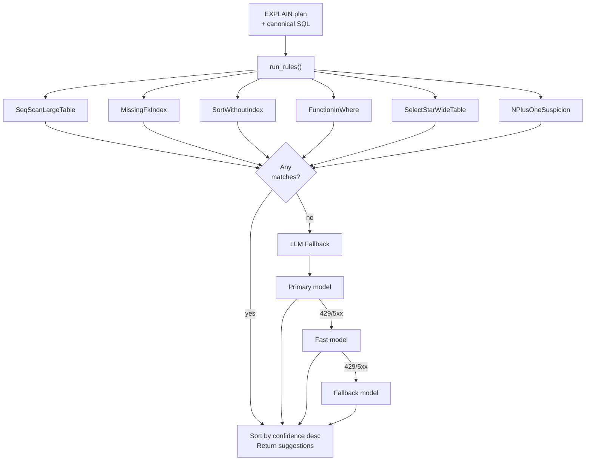
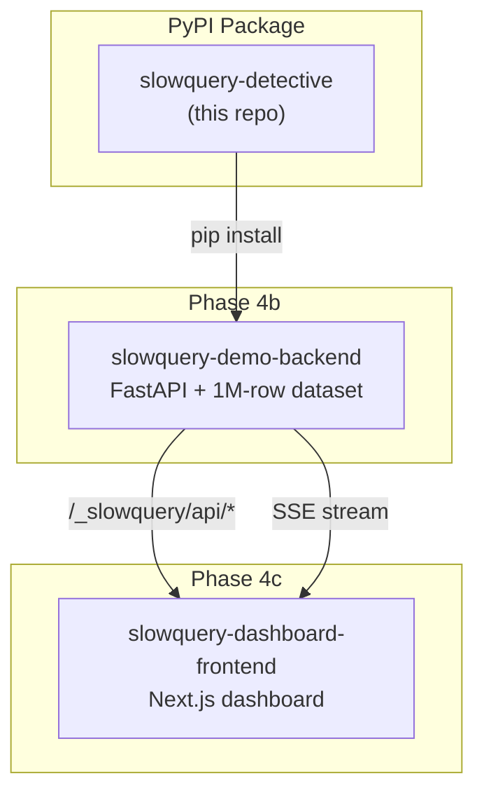

# 🔍 `slowquery-detective`

> 🐢 **Catch slow Postgres queries live. Suggest the index.**
> Drop-in FastAPI + SQLAlchemy middleware that fingerprints patterns, runs EXPLAIN asynchronously, and fixes what's actually slow.

[📦 PyPI](https://pypi.org/project/slowquery-detective/) · [📖 Specs](docs/specs/) · [🐛 Issues](https://github.com/Abdul-Muizz1310/slowquery-detective/issues) · [📜 License](LICENSE)

[](https://pypi.org/project/slowquery-detective/)
[](https://github.com/Abdul-Muizz1310/slowquery-detective/actions/workflows/ci.yml)


---

```python
from slowquery_detective import install

install(app, engine)          # that's it — fingerprinting, EXPLAIN, suggestions, all wired up
```

---

## 🤔 Why this exists

Your ORM generates SQL. Some of it is slow. You find out in production when p95 spikes and on-call pages you. Then you stare at `pg_stat_statements`, guess which query is the culprit, manually run `EXPLAIN`, and hope you remember the right index syntax.

**slowquery-detective** automates that entire loop. It hooks into SQLAlchemy events, fingerprints every query so `WHERE id=1` and `WHERE id=42` collapse into one pattern, tracks latency in a ring buffer, and when a pattern crosses the p95 threshold it runs `EXPLAIN (ANALYZE, BUFFERS, FORMAT JSON)` asynchronously — off the request path, with per-fingerprint rate limiting so a hot endpoint can't double its own latency. A deterministic rules engine catches the 80% of real wins (seq scans, missing FK indexes, sorts without indexes, functions in WHERE, `SELECT *`, N+1). When no rule matches, an OpenRouter-backed LLM explains the plan in plain English. The rules engine catches the boring wins — because real wins are boring and deterministic.

PII and secrets are scrubbed before they leave the process boundary. DDL application is gated behind a strict regex allowlist. This is a library, not a service — it runs inside your process, ships nothing externally.

## ✨ Features

- 🔬 **Fingerprinting via sqlglot** — literals scrubbed, patterns collapsed, PII never leaves the process
- 📊 **Ring buffer with 60s sliding window** — p50, p95, p99 per fingerprint in constant memory
- ⚡ **Async EXPLAIN** — off the hot path, per-fingerprint rate limiting prevents self-inflicted latency
- 🧠 **6-rule deterministic engine** — seq scan, missing FK index, sort without index, function in WHERE, `SELECT *`, N+1
- 🤖 **LLM fallback via OpenRouter** — 3-model cascade (primary → fast → fallback) with per-fingerprint cooldown
- 🛡️ **DDL allowlist** — only `CREATE INDEX [CONCURRENTLY] IF NOT EXISTS ix_<table>_<col>` passes the regex gate
- 📡 **Optional dashboard APIRouter** — list fingerprints, stream live p95 via SSE, one-click index application
- 🔒 **Security-first** — literal scrubbing, identifier validation, `DEMO_MODE` gate on DDL execution

## 🏗️ Architecture

### Data flow



### Rules engine dispatch



### Integration: the three repos



## 📁 Project structure

```
slowquery-detective/
├── src/slowquery_detective/
│   ├── __init__.py          # Public surface: install(), dashboard_router
│   ├── fingerprint.py       # sqlglot-based SQL fingerprinting
│   ├── buffer.py            # Ring buffer — 60s sliding window, p50/p95/p99
│   ├── hooks.py             # SQLAlchemy event listeners
│   ├── explain.py           # Async EXPLAIN worker with rate limiting
│   ├── rules/               # 6-rule deterministic engine
│   │   ├── base.py          # Rule protocol, run_rules(), shared utilities
│   │   ├── seq_scan.py      # Seq Scan on large tables
│   │   ├── missing_fk_index.py
│   │   ├── sort_without_index.py
│   │   ├── function_in_where.py
│   │   ├── select_star.py
│   │   └── n_plus_one.py
│   ├── llm_explainer.py     # OpenRouter LLM fallback with 3-model cascade
│   ├── store.py             # Persistence layer for fingerprints + suggestions
│   ├── dashboard.py         # Optional FastAPI APIRouter
│   └── middleware.py         # install() — wires everything together
├── docs/specs/              # 7 feature specs (Spec-TDD)
├── tests/
│   ├── unit/                # 177 unit tests
│   ├── integration/         # Testcontainers Postgres tests
│   └── fixtures/
├── pyproject.toml
└── LICENSE
```

## 📡 Dashboard API

Mount the optional router to expose these endpoints:

```python
from slowquery_detective import install, dashboard_router

install(app, engine)
app.include_router(dashboard_router, prefix="/_slowquery")
```

| Method | Path | Purpose |
|---|---|---|
| `GET` | `/_slowquery/api/queries` | List fingerprints, sorted by `total_ms` desc |
| `GET` | `/_slowquery/api/queries/{id}` | Detail: plan + suggestions + recent samples |
| `POST` | `/_slowquery/api/queries/{id}/apply` | Run suggested DDL (allowlist-gated, `DEMO_MODE=true` required) |
| `GET` | `/_slowquery/api/stream` | SSE: live p95 updates per fingerprint |

## ⚙️ Configuration

| Argument | Default | Description |
|---|---|---|
| `threshold_ms` | `100` | Queries slower than this are flagged for `EXPLAIN` |
| `sample_rate` | `1.0` | Fraction of statements to fingerprint (0.0–1.0) |
| `store_url` | `None` | Where to persist fingerprints/plans; defaults to the engine URL |
| `enable_llm` | `False` | Turn on the OpenRouter fallback |
| `llm_config` | `None` | Required when `enable_llm=True`; see `LlmConfig` |

Each argument validates at call time: negative `threshold_ms`, out-of-range `sample_rate`, or `enable_llm=True` without `llm_config` raise `ValueError`.

### LLM fallback

```python
from pydantic import SecretStr
from slowquery_detective import install
from slowquery_detective.llm_explainer import LlmConfig

llm_config = LlmConfig(
    enabled=True,
    api_key=SecretStr("sk-or-v1-..."),
    model_primary="nvidia/nemotron-nano-9b-v2:free",
    model_fast="google/gemma-3-27b-it:free",
    model_fallback="z-ai/glm-4.5-air:free",
)
install(app, engine, enable_llm=True, llm_config=llm_config)
```

The cascade is `PRIMARY → FAST → FALLBACK` on HTTP 429 / 5xx / network errors. `401` is non-retriable. Per-fingerprint cooldown (60s default) prevents a hot fingerprint from burning LLM credits.

## 🧱 Stack

| Layer | Choice |
|---|---|
| Python | 3.12+ |
| SQL parser | [sqlglot](https://github.com/tobymao/sqlglot) 25+ |
| Validation | [pydantic](https://docs.pydantic.dev/) 2.9+ |
| Async HTTP | [httpx](https://www.python-httpx.org/) 0.27+ |
| Logging | [structlog](https://www.structlog.org/) 24+ |
| Middleware | [FastAPI](https://fastapi.tiangolo.com/) 0.115+ (via `[fastapi]` extra) |
| LLM client | [openai](https://github.com/openai/openai-python) 1.40+ pointed at OpenRouter (via `[llm]` extra) |
| Dev | pytest, pytest-asyncio, respx, testcontainers, hypothesis, ruff, mypy |

## 🧪 Testing

| Metric | Value |
|---|---|
| Unit tests | 177 |
| Coverage | 84% |
| Feature specs | 7 (under `docs/specs/`) |
| Type checker | mypy strict, zero errors |

The test suite is **Spec-TDD**: 7 feature specs under [`docs/specs/`](docs/specs/) list every enumerated test case, and 195 pytest items encode them — 177 unit tests that run in CI, plus integration/slow tests gated on testcontainers Postgres.

```bash
uv run pytest                    # unit tests only (default)
uv run pytest -m integration     # testcontainers Postgres required
uv run pytest -m slow            # benchmark-style tests
```

## 🧭 Engineering philosophy

| Principle | How it's applied |
|---|---|
| **Spec-TDD** | Every feature starts as a spec in `docs/specs/`, test cases enumerated before code is written |
| **Negative-space programming** | Illegal states unrepresentable — `Suggestion` is frozen Pydantic, `SuggestionKind` is a `Literal` union, identifier regex rejects injection |
| **Pure core, imperative shell** | Rules are pure functions of `(plan, sql, fingerprint_id, call_count)` — no I/O, fully unit-testable |
| **Parse, don't validate** | `install()` rejects invalid config at call time; `LlmConfig` validates via Pydantic; DDL allowlist regex is the only gate |
| **Typed everything** | mypy strict, Pydantic models at every boundary, no `Any` crossing module lines |

## 🚀 Status

| Milestone | Status |
|---|---|
| v0.1.0 on [PyPI](https://pypi.org/project/slowquery-detective/) | ✅ Released 2026-04-11 |
| 177 unit tests, 84% coverage, mypy strict | ✅ Green |
| `pip install slowquery-detective[fastapi,llm]` in fresh 3.12 venv | ✅ Verified |
| Live demo ([slowquery-demo-backend](https://github.com/Abdul-Muizz1310/slowquery-demo-backend)) | 🟡 Phase 4b |
| Dashboard ([slowquery-dashboard-frontend](https://github.com/Abdul-Muizz1310/slowquery-dashboard-frontend)) | 🟡 Phase 4c |

## 📄 License

MIT — see [LICENSE](LICENSE).

---

> *Catch the pattern, not the literal. Suggest the index, not the prayer.* — slowquery-detective
