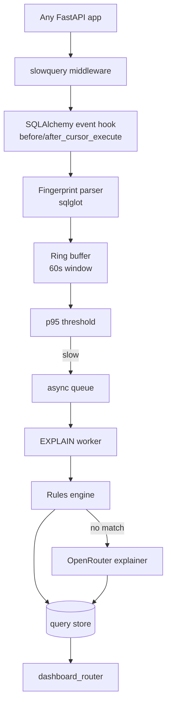

# Architecture

> Status: placeholder. Filled in alongside S2 (spec writing) and S3 (implementation).

## Component map

| Module | Responsibility | Spec |
|---|---|---|
| `fingerprint.py` | Parameterize literals via sqlglot, produce stable fingerprint ID | `00-fingerprint.md` |
| `buffer.py` | 60s ring buffer per fingerprint; p50/p95/p99 on demand | `01-buffer.md` |
| `hooks.py` | SQLAlchemy `before_cursor_execute` / `after_cursor_execute` listeners | `02-hooks.md` |
| `rules/` | Deterministic rule set (seq scan, missing FK, sort, function-in-WHERE, SELECT *, N+1) | `03-rules.md` |
| `llm_explainer.py` | OpenRouter fallback, strict JSON response | `04-explainer.md` |
| `middleware.py` | `install(app, engine, ...)` factory + `dashboard_router` | `05-middleware.md` |

## Layering rules

- `middleware.py` never imports a rule directly. Rules are discovered through `rules/__init__.py`.
- `hooks.py` never touches the DB — it only pushes onto the ring buffer / async queue.
- `llm_explainer.py` is only called when the rules engine returns `None`; never in the hot path.
- `rules/*.py` are pure functions of `(plan_json, canonical_sql)`; no I/O.

See `WHY.md` for the design rationale.
