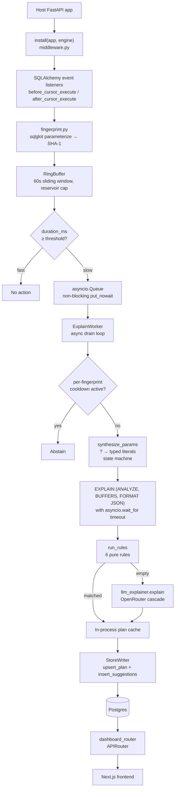
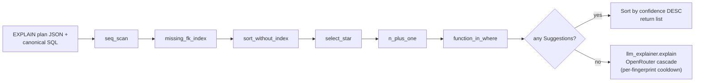
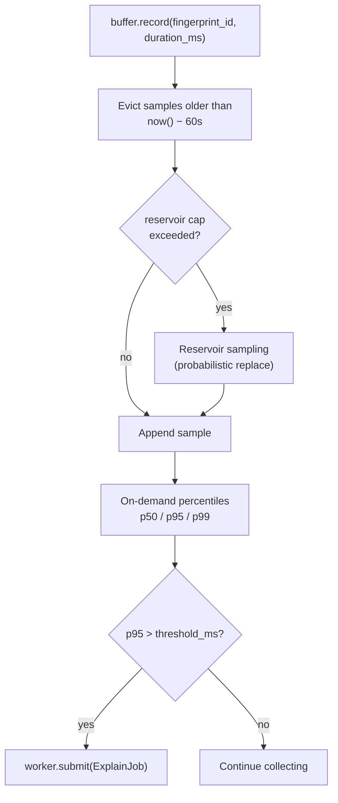
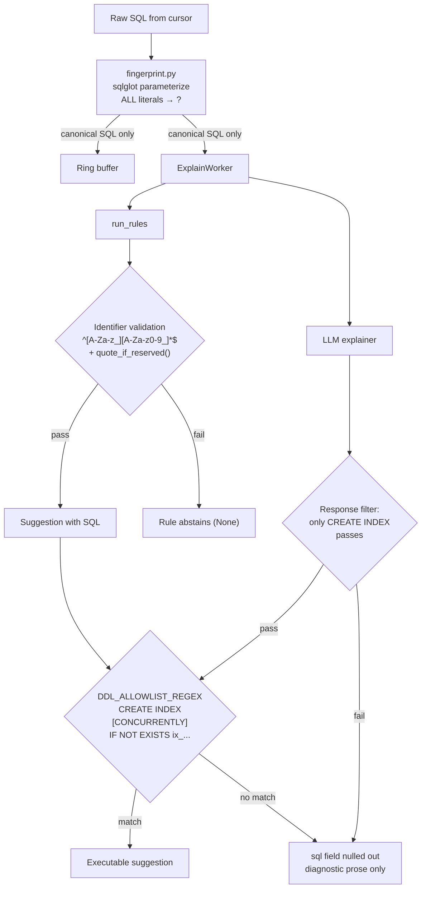

# Architecture

## Overview



## Rules dispatch

`run_rules` iterates all six rules in registration order, collects non-`None` results, sorts by confidence descending, and returns. On empty, the worker falls back to the LLM explainer.



## Ring buffer architecture

Each fingerprint gets a sliding-window buffer that retains samples from the last 60 seconds. Reservoir sampling caps memory when a hot query fires thousands of times within that window.



## Security boundary diagram

PII scrubbing, DDL allowlisting, and identifier validation form three defense layers at different points in the pipeline.



## Component map

Every component lives in its own module. Each row references the feature spec it implements.

| Module | Responsibility | Spec |
|---|---|---|
| [`fingerprint.py`](../src/slowquery_detective/fingerprint.py) | Parse via sqlglot, scrub literals + parameters, SHA-1 the canonical form | [`00-fingerprint.md`](specs/00-fingerprint.md) |
| [`buffer.py`](../src/slowquery_detective/buffer.py) | 60s sliding-window ring buffer with reservoir cap and p50/p95/p99 on demand | [`01-buffer.md`](specs/01-buffer.md) |
| [`hooks.py`](../src/slowquery_detective/hooks.py) | SQLAlchemy `before_cursor_execute` / `after_cursor_execute` listeners | [`02-hooks.md`](specs/02-hooks.md) |
| [`rules/*.py`](../src/slowquery_detective/rules/) | Six pure rules + `run_rules` dispatcher with confidence-desc ordering | [`03-rules.md`](specs/03-rules.md) |
| [`llm_explainer.py`](../src/slowquery_detective/llm_explainer.py) | OpenRouter cascade with per-fingerprint cooldown and destructive-DDL scrub | [`04-explainer.md`](specs/04-explainer.md) |
| [`middleware.py`](../src/slowquery_detective/middleware.py) | `install()` wires everything onto a FastAPI app + SQLAlchemy engine | [`05-middleware.md`](specs/05-middleware.md) |
| [`explain.py`](../src/slowquery_detective/explain.py) | Async EXPLAIN runner, per-fingerprint rate limit, parameter synthesizer, plan cache | [`06-explain-worker.md`](specs/06-explain-worker.md) |
| [`dashboard.py`](../src/slowquery_detective/dashboard.py) | APIRouter surface + `DDL_ALLOWLIST_REGEX` lockdown constant | [`05-middleware.md`](specs/05-middleware.md) |
| [`store.py`](../src/slowquery_detective/store.py) | Async writer for fingerprints, samples, plans, suggestions | -- (lands with Phase 4b schema) |

## Layering discipline

```
middleware → (hooks | buffer | explain_worker | store | dashboard)
                         ↓
                  rules → llm_explainer
                  ↓
              fingerprint
```

- **`middleware.py` never imports a rule directly.** Rules are registered via `rules/__init__.py` and dispatched through `run_rules`.
- **`hooks.py` never touches the DB.** It only fingerprints + records into the ring buffer. Slow-query detection (threshold comparison + enqueue to the worker) is the middleware's job.
- **`llm_explainer.py` is only called on rules miss.** The explain worker owns the ordering; rules run first and the LLM is consulted only when `run_rules(...) == []`. No rule calls the LLM directly.
- **Rules are pure.** No I/O, no clock, no database. They receive `(plan_json, canonical_sql, fingerprint_id, recent_call_count)` and return a `Suggestion` or `None`.
- **`submit()` is sync and non-blocking.** Called from the SQLAlchemy hook (which runs in sync context even on async engines), it does one `put_nowait` and returns `True`/`False`. The overhead budget is <= 10 us per call; anything heavier starves the request.

## Data flow for a slow query

1. FastAPI handler runs `await session.execute(stmt)`.
2. SQLAlchemy `before_cursor_execute` fires -- `time.perf_counter()` stashed in `cursor.info`.
3. Cursor executes the statement.
4. `after_cursor_execute` fires -- duration calculated -- `fingerprint()` produces `(fingerprint_id, canonical_sql)` -- `buffer.record(fingerprint_id, duration_ms)`.
5. Middleware checks `duration_ms >= threshold_ms`. If yes, `worker.submit(ExplainJob(...))` -- non-blocking.
6. The worker's drain loop dequeues the job, checks its per-fingerprint cooldown (abstains if active), synthesizes representative parameter values for the canonical SQL (`?` -> `1` / `''` / `true` / `now()` / `NULL` based on column-context heuristics).
7. Worker runs `EXPLAIN (ANALYZE, BUFFERS, FORMAT JSON)` against the engine, wrapped in `asyncio.wait_for(..., timeout=explain_timeout_seconds)`. On timeout or invalid-literal errors, the worker retries once with plain `EXPLAIN` (no `ANALYZE`), preserving visibility even when the synthesized literal doesn't execute.
8. Plan feeds into `run_rules(plan, canonical_sql)`. Matching rules return `Suggestion` objects sorted by confidence desc. On empty, the worker calls `llm_explainer.explain(...)` if configured.
9. The plan + suggestions are cached in-process (`plan_cache_get(fingerprint_id)`) and written to the store via `StoreWriter.upsert_plan` + `StoreWriter.insert_suggestions`.
10. The per-fingerprint cooldown is set to `now() + per_fingerprint_cooldown_seconds` so a hot query can't re-trigger EXPLAIN in a tight loop.
11. Dashboard `GET /api/queries/{id}` reads straight from the store, never re-runs EXPLAIN on demand.

## Security invariants

1. **No literal content survives anywhere.** `fingerprint()` parameterizes before anything else sees the SQL. Logs, ring buffer, plan cache, store writes, and LLM requests all operate on canonical (`?`-only) forms. A hypothesis property test in [`test_fingerprint.py`](../tests/unit/test_fingerprint.py) asserts this across 200+ random literal shapes per test run.
2. **DDL execution is allowlist-gated.** `DDL_ALLOWLIST_REGEX` in [`dashboard.py`](../src/slowquery_detective/dashboard.py) accepts exactly `CREATE INDEX [CONCURRENTLY] IF NOT EXISTS ix_<table>_<col(s)>`. An adversarial unit suite of 27 parametrized cases -- including Cyrillic homograph attacks, whitespace tricks, and injection attempts with embedded `DROP TABLE` -- locks the regex in place as a permanent regression guard.
3. **Rule-generated identifiers are whitelist-checked.** Every table/column name a rule formats into SQL must match `^[A-Za-z_][A-Za-z0-9_]*$` or the rule abstains. Reserved-word collisions (`"user"`, `"order"`) are double-quoted via `quote_if_reserved()`.
4. **No rule source contains `DROP`, `ALTER`, `TRUNCATE`, `GRANT`, `REVOKE`, `UPDATE`, or `DELETE`.** A grep-based regression guard runs on every CI build.
5. **LLM responses are filtered.** If the model proposes anything other than `CREATE INDEX ...`, the suggestion is retained as diagnostic prose but the executable `sql` field is nulled out. API keys are held in `SecretStr` and never appear in any structlog record.
6. **Per-fingerprint cooldown on the LLM call.** 60s default. Stops a hot fingerprint from burning OpenRouter credits or leaking timing information to a third-party service more than once per cooldown window.

## Test layout

| Layer | Count | Runs in CI? |
|---|---|---|
| Unit (`tests/unit/`) | 177 | Yes (default filter: `-m "not slow and not integration"`) |
| Integration (`tests/integration/`) | 53 | No -- needs testcontainers Postgres, run locally via `uv run pytest -m integration` |
| Slow (`@pytest.mark.slow`) | 3 | No -- benchmark-style, run via `uv run pytest -m slow` |
| **Total** | **233** | |

Coverage on `src/slowquery_detective` stands at **84.01%** from unit tests alone. Running the integration suite locally pushes hooks (38%) and middleware (45%) well above 80% -- their meat lives in the end-to-end cases that need a real database.

## Deferred components

The data model in [`50-slowquery-detective.md`](../../docs/projects/50-slowquery-detective.md) defines four tables -- `query_fingerprints`, `query_samples`, `explain_plans`, `suggestions`. The `store.py` module has typed interfaces for all four but the concrete Alembic migrations + asyncpg implementation land with `slowquery-demo-backend` in Phase 4b, which needs them alongside its own schema. The package ships with `StoreWriter` as a thin interface that returns `NotImplementedError` if called before a concrete implementation is wired -- the demo backend provides one; library users who want to use `slowquery-detective` standalone can subclass `StoreWriter` against their own DB.
